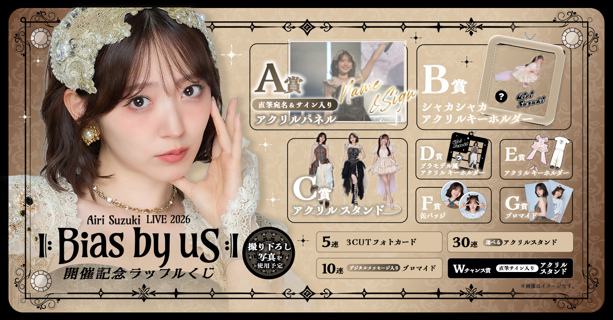
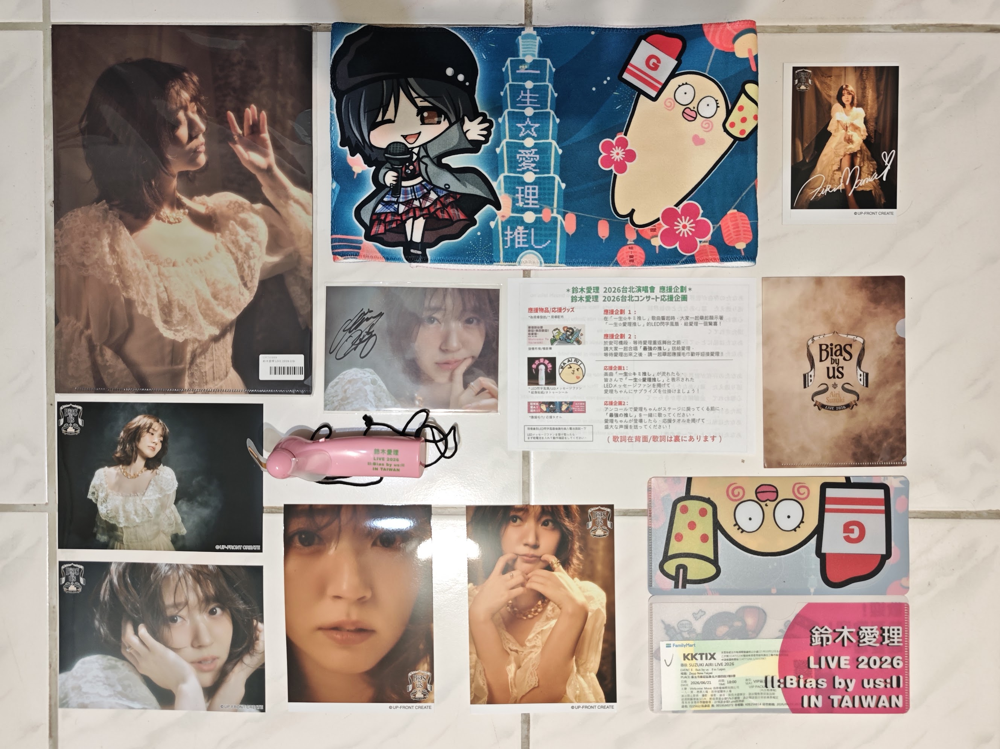

[鈴木愛理 2026 ||:Bias by us:|| 紀念線上抽獎](https://raffle-kuji.jp/lotteries/1388)，有點像是一番賞，把它當作是線上的一番賞去抽就對了。
東西基本上都是live表演或是live的服裝所拍攝的照片下去製作，如果有參加任何一場live的都推薦收藏。
好像也不是這麼說的，只要是粉絲都買買買。

- 活動網址：[https://raffle-kuji.jp/lotteries/1388](https://raffle-kuji.jp/lotteries/1388)
- 活動期間：2026年08月04日 19:00 ~ 2026年09月19日 00:59（日本時間）
- 價格：單次770日元（含稅），約新台幣150元
- 預計發貨時間：2026年12月中

**快速說說要抽多少比較好，主要可以分成幾個方案：**

> 1. 預算多的：45抽（5抽+10抽+30抽）。運氣真的很差很差，也至少還是有一個C賞立牌
> 2. 預算中等的：15抽（5抽+10抽）。拿兩個特典，剩下的交給運氣
> 3. 預算比較不足的：10抽。至少拿一個特點
> 4. ~不差錢的：全部齊了再說~

{}
単発（1回ボタン）で引いた方は多連特典の対象とはなりませんのでご注意ください

使用「單抽（1回）」按鈕進行抽獎的人，將無法獲得連抽特典

只**單抽30抽**會沒有辦法拿到5、10抽的特典

寄送**只限日本當地**，要寄台灣的話可能要自行集運
{}

如果不在乎會抽到甚麼的，就直接拿出魔法小卡，就不用往下看了。
底下會簡單說一下有哪些項目、配送還有參加流程等一些資訊。

<!--more-->

目錄可以自行跳轉到想看的地方。



## 常規獎品池獎項

共有7個不同的獎項。
有些款式的圖片還沒有公開，我也不是很確定會不會在活動結束前公開。

| 等級    | 獎項內容                | 款式數量 | 中獎機率 |
| :------ | :---------------------- | :------: | :------: |
| **A賞** | 親筆署名 & 親簽壓克力牌 |   1 款   |   0.4%   |
| **B賞** | 搖搖壓克力鑰匙圈        |   1 款   |   1.5%   |
| **C賞** | 壓克力立牌              |   9 款   |   5.0%   |
| **D賞** | 模型風格壓克力鑰匙圈    |   4 款   |   9.0%   |
| **E賞** | 壓克力鑰匙圈            |   4 款   |  13.0%   |
| **F賞** | 徽章                    |   8 款   |  34.0%   |
| **G賞** | 相片/寫真卡             |  12 款   |  37.1%   |

### A賞｜親筆簽名＋指定收件名壓克力展示板

約 A5 尺寸。中獎後必須輸入 10 個字以內的收件名；
未填寫時會使用帳戶登記姓名。實物將使用演唱會當日拍攝照片。


### B賞｜搖搖壓克力鑰匙圈

全長約 90 mm。


### C賞｜壓克力立牌

立牌好讚好可愛。

全長約 135 mm 以內；共 9 款，尺寸隨設計不同而異。第 7～9 款將使用演唱會當日拍攝照片。


### D賞｜模型板風壓克力鑰匙圈

全長約 60 mm 以內；共 4 款。


### E賞｜壓克力鑰匙圈

約寬 40 × 高 70 mm 以內；共 4 款，尺寸隨設計不同而異。


### F賞｜徽章

直徑約 57 mm；共 8 款。第 5～8 款將使用演唱會當日拍攝照片。


### G賞｜寫真卡

約 89 × 127 mm；共 12 款。第 7～12 款將使用演唱會當日拍攝照片。


## 加碼活動與連抽特典

5、10抽特典不再常規的獎品內，所以是值得單獨去抽的。
W Chance 賞每抽一次額外獲得一次**抽獎機會**的特別獎，不同時間抽會有不同的立牌。

| 類型        | 項目名稱          | 獲得方式與條件         |   機率 / 數量   |
| :---------- | :---------------- | :--------------------- | :-------------: |
| 5 連特典    | 3格相片卡         | 單次「5連」抽獎        |        -        |
| 10 連特典   | 數位留言生寫真    | 單次「10連」抽獎       |        -        |
| 30 連特典   | 自選C賞壓克力立牌 | 單次「30連」抽獎       |        -        |
| W Chance 賞 | 親簽壓克力立牌    | 每抽1次獲得1次抽獎資格 | 每彈限定抽 1 名 |

### 5連抽特典｜三連拍照片卡

約 33 × 86 mm（預定）。第 2 款實際商品預計使用演唱會當天拍攝的照片。


### 10連抽特典｜含數位訊息的寫真卡

這個不太清楚是甚麼，可能有經驗的大大可以說下，我猜可能會有個QRCode可以掃，然後會有留言？

約 127 × 178 mm（預定）。實際商品預計使用演唱會當天拍攝的照片。


### 30連抽特典｜壓克力立牌

可以**自選立牌**，看了一下款式應該就是C賞的立牌，要必中立牌的選這個沒有錯。

全長約 135 mm 以內（預定），尺寸會依設計而不同。第 7～9 款實際商品預計使用演唱會當天拍攝的照片。中獎後需在選項欄位選擇想要的商品款式。


### W Chance 賞｜親簽壓克力立牌

~反正機會不是我的，看都不看。~

如果要抽這個獎的話，可以參考下面的日期，如果要抽很多次的話可以分不同時段去抽。

- 第 1 彈：8/4 18:00 ～ 8/9 23:59
- 第 2 彈：8/10 00:00 ～ 8/14 23:59
- 第 3 彈：8/15 00:00 ～ 8/19 23:59
- 第 4 彈：8/20 00:00 ～ 8/24 23:59
- 第 5 彈：8/25 00:00 ～ 8/29 23:59
- 第 6 彈：8/30 00:00 ～ 9/3 23:59
- 第 7 彈：9/4 00:00 ～ 9/8 23:59
- 第 8 彈：9/9 00:00 ～ 9/13 23:59
- 第 9 彈：9/14 00:00 ～ 9/18 23:59

加碼賞，每期抽 1 人。獎品是親筆簽名壓克力立牌，共 9 期、對應 9 款。


---

## 選擇與注意事項

首先要先說一下價格跟運費的部分，價格是1抽770日幣，然後**每10抽就會多收一筆運費**，運費每10抽660日幣。
假設抽10抽+5抽的話，運費就會要收到兩筆，所以價格會是`770 * 15 + 660 * 2 = 12870`（約新台幣2630元）。

> 1. 預算多的：45抽（5抽+10抽+30抽）。日幣37860元，約新台幣7737元
> 2. 預算中等的：15抽（5抽+10抽）。日幣12870元，約新台幣2630元
> 3. 預算比較不足的：10抽。日幣8360元，約新台幣1708元

根據前面說的方案，其實原本沒有推薦第三個選項的，但算下來說實話，也不是非常便宜。

首先第一個方案，其實原本是在想30抽有沒有可能是沒有必要的，因為如果`5抽 * 2+10抽 * 2共30抽`，好像也不是不行，
就真的是怕沒有抽到C賞，所以才補上這個的。可以先嘗試`5抽+10抽`，然後真的什麼都沒有30抽就可以下去了。

第二個方案覺得是比較剛好的部分，就把兩個特典拿齊吧，有沒有立牌就看命😂。

第三個方案，因為5抽跟10抽運費都一樣，就直接湊到10抽划算一點。
如果5抽+5抽感覺特典重複的機率又太高。就看怎麼選擇吧。

另外要注意的是**發貨時間是12月**，好久好久，應該是有點像是那種預購的形式吧，確定總量多少量才下單，
不是很喜歡這種做法，不過看到群友說，抽的時候開心一次，收到貨的時候可以再開心一次，~好像就沒那麼糟了~。

然後再來就是**只能送日本地址**，可能需要自己找個集運，這點可能就比較麻煩一點。
後續可能也寫個我是用什麼集運跟推薦吧，雖然我也沒有用過幾個。

## 怎麼玩？



1. 先到[RAFFLE](https://raffle-kuji.jp/)網站上註冊帳號
2. 註冊完成後[鈴木愛理 LIVE 2026 ll:Bias by us:ll 開催記念ラッフルくじ](https://raffle-kuji.jp/lotteries/1388)點擊參加
3. 如果前面沒有填寫寄送地址跟名稱的話，會要求填寫
4. 接下來就會跳轉至選擇幾抽的介面，儲值你要玩的數量，確定完成就送出
5. 會要求選擇想要的支付方式，應該大部分都是用信用卡，選第一個即可
6. 選擇添加信用卡，然後確認付款之後，就儲值完成了
7. 儲值完成後會顯示你的coin有多少
8. 滑到最下方點選抽獎`くじを引く`
9. 開始抽獎，就是一抽一抽玩。最後會出現抽選結果，還有可以抽的W賞是哪個（QAQ沒有C賞
10. 最後要求填寫問卷，然後才會獲得抽W賞的資格
11. ~沒有抽到喜歡的東西的話，"もう一度くじを引く"直接按下去~

大致上流程就是這樣，祝大家玩得開心，都能抽到想要的東西。

## 寫在後面跟一些碎念

第一次的Live VIP站票就給愛理了，朋友幫搶搶到100多號。
當天真的是站到蠻累的，但真的值得，原本都在螢幕上看，終於看到愛理本人了還超級近。

Live結束後加了社群大家一起聊天，原來很多人是被跨年場圈粉的嗎。
雖然自己當時是看直播，但也感覺得出來底下真的沒有到非常熱烈。
原本很想要衝的，但我記得跨年場我還在實驗室看直播🥲。

這次Bias by us的台北場真的很感動，大合唱有唱起來真是太好了，應援團的粉絲們也超級用心，第一次拿到這麼多應援物。附上圖，風扇還會有字喔：

小聲說香港場其實有點想去，但是我前幾天才在看所有的資訊，最後還是沒出發。下..下次一定🥲。

## 參考資料

1.  https://raffle-kuji.jp/lotteries/1388
